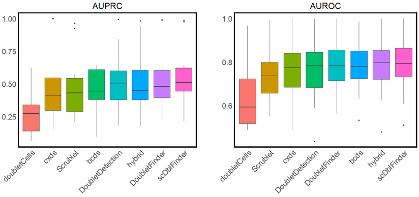

# DoubletCollection
`DoubletCollection` is an R package that integrates the installation, execution and benchmark of eight cutting-edge computational doublet-detection methods. `DoubletCollection` provides a unified interface to conduct downstream analysis and visualize the result after doublet detection. An detailed description of `DoubletCollection` is available in our [STAR Protocols preprint](https://arxiv.org/abs/2101.08860). A comprehensive description of the methodology to benchmark computational doublet-detection methods is avaiable in our [Cell System paper](https://www.sciencedirect.com/science/article/pii/S2405471220304592?dgcid=author).
## Updates
05/07/2021: Version 1.0.0 released.
06/18/2021: Version 1.1.0 released.

# Installation
To install `DoubletCollection`, please execute the following `R` code:
``` r
if(!require(devtools)){
  install.packages("devtools") 
}
devtools::install_github("xnnba1984/DoubletCollection")
``` 
`DoubletCollection` will automatically install eight doublet-detection methods and other dependent packages. The eight methods include [DoubletFinder](https://github.com/chris-mcginnis-ucsf/DoubletFinder), [Scrublet](https://github.com/AllonKleinLab/scrublet), [scDblFinder](https://github.com/plger/scDblFinder), [scds](https://github.com/kostkalab/scds) (cxds, bcds, hybrid), [DoubletDetection](https://github.com/JonathanShor/DoubletDetection), and [doubletCells](https://rdrr.io/bioc/scran/man/doubletCells.html).

# Datasets
The example `R` code below will use a collection of 16 real scRNA-seq datasets with doublets annotated by experimental techniques. This collection covers a variety of cell types, droplet and gene numbers, doublet rates, and sequencing depths. It represents varying levels of difficulty in detecting doublets from scRNA-seq data. The data collection and preprocessing details are described in our [Cell System paper](https://www.sciencedirect.com/science/article/pii/S2405471220304592?dgcid=author). The datasets are available at Zenodo https://zenodo.org/record/4562782#.YI2lhWf0mbg in the file real_datasets.zip.

# Quick Start
Below we show example `R` code to perform doublet detection on 16 real datasets by eight doublet-detection methods. We visualize the result to compare the performance of different methods. For the full illustration of how to use `DoubletCollection`, please check our [STAR Protocols preprint](https://arxiv.org/abs/2101.08860).
## Calculate doublet scores
Every doublet-detection method in `DoubletCollection` outputs a doublet score for each droplet in the dataset. The larger the doublet score is, the more likely the droplet is a doublet. The following R code calculates doublet scores of user-specified methods on 16 real datasets.
``` r
library(DoubletCollection)

# read 16 datasets in the folder real_datasets
data.list <- ReadData(path = ".../real_datasets")
count.list <- data.list$count

# transform doublet annotations to 0/1
label.list <- lapply(data.list$label, FUN = function(label){
     ifelse(label == 'doublet', 1, 0)
})
methods <- c('doubletCells','cxds','bcds','hybrid','scDblFinder',
'Scrublet','DoubletDetection','DoubletFinder')

# calculate doublet scores
score.list.all <- FindScores.All(count.list, methods)
```
## Calculate the area under the precision-recall curve (AUPRC) and the area under the receiver operating characteristic curve (AUROC) 
Doublet detection is essentially a binary classification problem. Therefore, AUPRC and AUROC are appropriate for evaluating the overall doublet-detection accuracy. The following R code calculates AUPRC and AUROC based on the doublet scores.
``` r
auprc.list.all <- FindAUC.All(score.list.all, label.list, 'AUPRC')
auroc.list.all <- FindAUC.All(score.list.all, label.list, 'AUROC')
```
## Visualize overall doublet-detection accuracy 
We use boxplots to visualize the distributions of AUPRC and AUROC values of every doublet-detection method on the 16 real scRNA-seq datasets.
``` r
# transform to a data frame for visualization
result.auprc <- ListToDataframe(auprc.list.all, 'boxplot')
result.auroc <- ListToDataframe(auroc.list.all, 'boxplot')

# visualize AUPRC and AUROC by boxplots 
# save each plot to a file in the current working directory
Plot_Boxplot(result.auprc, 'AUPRC', save=T, name = 'AUPRC_real.png', path = getwd())
Plot_Boxplot(result.auroc, 'AUROC', save=T, name = 'AUROC_real.png', path = getwd())
```

# Contact
If you have any suggestions and comments on the package, please contact Nan Miles Xi (<nxi@ucla.edu>) or Jingyi Jessica Li (<jli@stat.ucla.edu>). 
# Citation
If you use `DoubletCollection` in your work, please cite 

Xi, N.M. and Li, J.J. (2021). Benchmarking computational doublet-detection methods for single-cell RNA sequencing data. Cell Systems 12:1-19. 

Xi, N.M. and Li, J.J. (2021). Protocol for benchmarking computational doublet-detection methods in single-cell RNA sequencing data analysis. arXiv.
